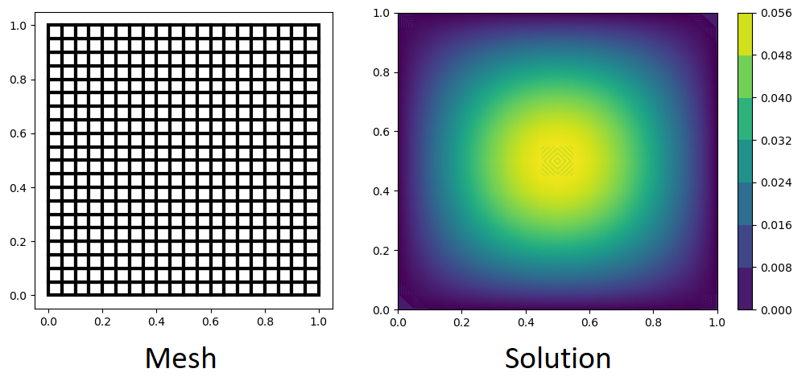

# Poisson equation
This repository contains finite element code for solution of Poisson's equation.

$$
\begin{align}
-\nabla^{2} u&=f \text { in } \Omega \\
u&=0 \text { on } \partial \Omega \\
f&=4\left(-y^{2}+y\right) \sin (\pi x)
\end{align}
$$

on the square domain $\Omega:=(0,1) \times(0,1)$ using a structured mesh of four-noded quadrilateral Lagrange elements.

## Getting Started
This code is based on general purpose numerical libraries `numpy` and `matplotlib` and is based on python3.
### Dependencies
To install the libraries on your system first install python3 and then run the following commands in terminal.
```
pip install numpy
pip install matplotlib
```
### Running
Run the following in the directory which contains the `main.py` file.
```
python main.py
```
## Solution

